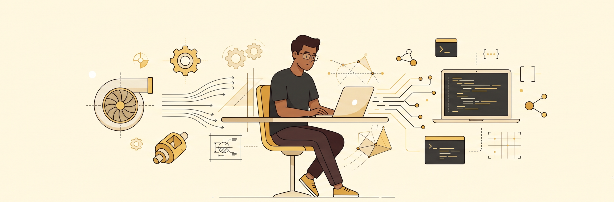
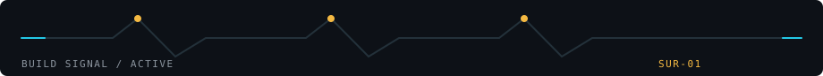

<div align="center">
  
</div>

<div align="center">

# SURENDHER_R

### Mechanical engineering × simulation × useful software

I turn physical problems into models, simulations, and tools that people can actually use.

[View projects](https://github.com/suren1013?tab=repositories) · [Follow the build](https://github.com/suren1013?tab=followers) · [GitHub profile](https://github.com/suren1013)

</div>

<br />



## Workshop status

```text
NOW BUILDING   engineering tools, simulations, and useful software
CURRENT FOCUS  thermal engineering + forced-air cooling + CFD
LEARNING       OpenFOAM, numerical methods, and better engineering code
OPERATING ON   curiosity, clear reasoning, and systems that actually work
```

## From physics to working systems

I am a Mechanical Engineering student building at the intersection of **engineering and software**. My work usually starts with a physical system—heat transfer, fluid flow, machine design, or engineering data—and asks how computation can help us understand it, improve it, or make it easier to use.

I use AI to shorten the distance between an idea and a working prototype, while keeping the engineering assumptions, architecture, and decisions grounded in the real problem.



## What I work on

| 01 / Mechanical | 02 / Simulation | 03 / Software |
| :--- | :--- | :--- |
| Heat transfer, thermal systems, machine design, and engineering problem-solving. | CFD, FEA, numerical modelling, and translating physical systems into computable models. | Web tools, automation, AI-assisted workflows, and software built around engineering needs. |

## Current work

My present focus is **thermal engineering and CFD**, including an OpenFOAM-based study of forced-air cooling for avionics heat sinks.



Alongside simulation work, I build dashboards, workflow automations, and small developer utilities. I am especially interested in projects where software does more than display information—it becomes part of the engineering workflow itself.

Long term, I want to work on large-scale aerospace and space systems, especially thermal management, fluid mechanics, structures, and rotating space habitats.

## Working palette

| Engineering | Code | Tools |
| :--- | :--- | :--- |
| `OpenFOAM` `ANSYS` `SolidWorks` `CFD` `FEA` `Heat Transfer` | `Python` `TypeScript` `JavaScript` `React` `Next.js` `Java` | `Git` `GitHub` `VS Code` `LangChain` |

## Build principles

- Understand the physical system before abstracting it.
- Make assumptions visible and results measurable.
- Build the smallest useful version, then validate it.
- Use AI to accelerate judgment—not replace it.
- Close the loop: learn from the result and improve the model.

> **Current signal:** Understand the system. Build the simplest useful version. Then make it better.

<div align="center">

### [Explore the repository archive →](https://github.com/suren1013?tab=repositories)

<sub>Mechanical engineering, computation, and a lot of building.</sub>

</div>
