

  

 

SURENDHER_R &nbsp; / &nbsp; MECHANICAL ENGINEERING × SIMULATION × USEFUL SOFTWARE

**I turn physical problems into models, simulations, and tools that people can actually use.**

[View the motion version](./README.md) &nbsp; / &nbsp; [Selected projects](#selected-work) &nbsp; / &nbsp; [Repository archive](https://github.com/suren1013?tab=repositories) &nbsp; / &nbsp; [LinkedIn](https://www.linkedin.com/in/surendher-r/) &nbsp; / &nbsp; [Email](mailto:rsurendher35@gmail.com)

 

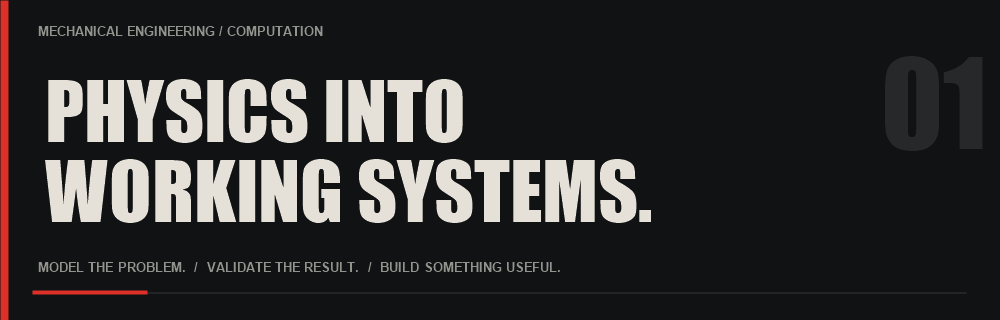

01 / From physics to working systems — read the profile

I am a Mechanical Engineering student building at the intersection of **engineering and software**. My work usually starts with a physical system—heat transfer, fluid flow, machine design, or engineering data—and asks how computation can help us understand it, improve it, or make it easier to use.

I use AI to shorten the distance between an idea and a working prototype, while keeping the engineering assumptions, architecture, and decisions grounded in the real problem.

 

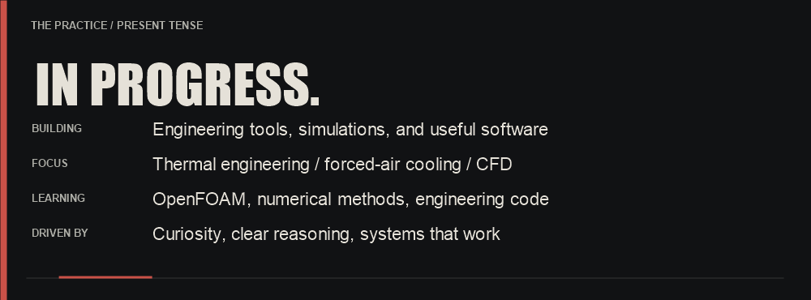

Workshop status — text version

| WORKSHOP STATUS | |
| :--- | :--- |
| **Now building** | Engineering tools, simulations, and useful software |
| **Current focus** | Thermal engineering + forced-air cooling + CFD |
| **Learning** | OpenFOAM, numerical methods, and better engineering code |
| **Operating on** | Curiosity, clear reasoning, and systems that actually work |

 

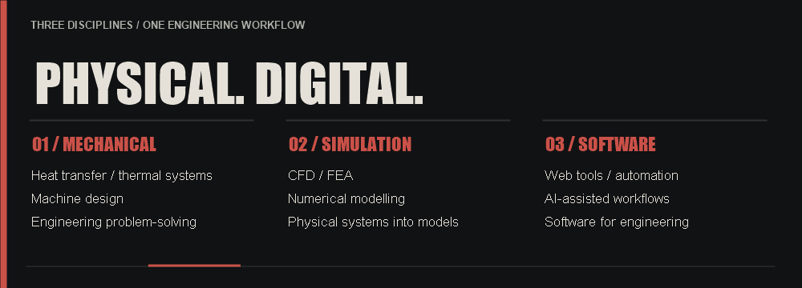

What I work on — disciplines and scope

| 01 / Mechanical | 02 / Simulation | 03 / Software |
| :--- | :--- | :--- |
| Heat transfer, thermal systems, machine design, and engineering problem-solving. | CFD, FEA, numerical modelling, and translating physical systems into computable models. | Web tools, automation, AI-assisted workflows, and software built around engineering needs. |

 

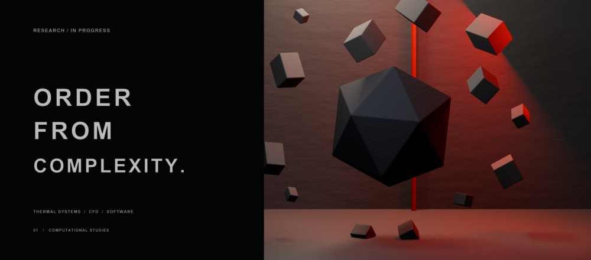

02 / Current work — thermal engineering, CFD & aerospace

My present focus is **thermal engineering and CFD**, including an OpenFOAM-based study of forced-air cooling for avionics heat sinks.

Alongside simulation work, I build dashboards, workflow automations, and small developer utilities. I am especially interested in projects where software does more than display information—it becomes part of the engineering workflow itself.

Long term, I want to work on large-scale aerospace and space systems, especially thermal management, fluid mechanics, structures, and rotating space habitats.

 

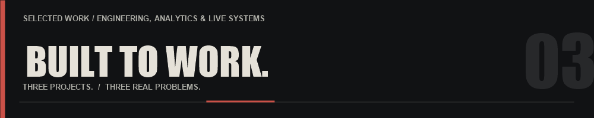

 

<a href="https://github.com/suren1013/Casting-Assistant">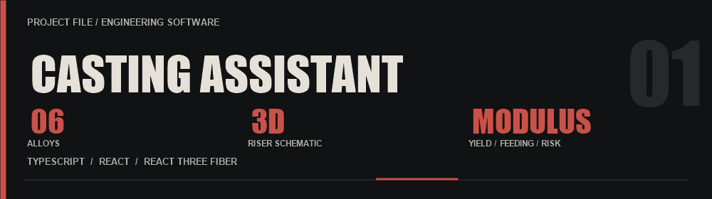</a>

[01 — Casting Assistant →](https://github.com/suren1013/Casting-Assistant)

Open project file — problem & implementation

**Problem** — Early casting design requires several connected decisions around geometry, feeding, riser sizing, material use, and process risk.

**Built** — An interactive engineering dashboard that calculates casting and riser modulus, yield, feeding distance, material waste and cost, and design-risk flags across six alloys, supported by a 3D riser schematic.

 

<a href="https://github.com/suren1013/customer-clv-dashboard">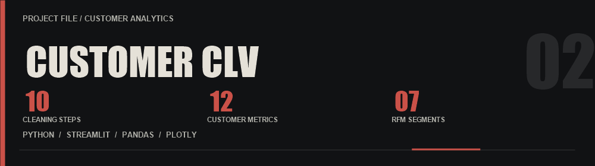</a>

[02 — Customer CLV Dashboard →](https://github.com/suren1013/customer-clv-dashboard)

Open project file — problem & implementation

**Problem** — Raw transaction data needs substantial validation and transformation before it can support useful customer decisions.

**Built** — An upload-to-export analytics workflow with CSV validation, a 10-step cleaning pipeline, 12 customer metrics, seven RFM segments, CLV calculation, customer exploration, and CSV, Excel, PDF, and PNG exports.

 

<a href="https://github.com/suren1013/TN-Election-Live-Dashboard">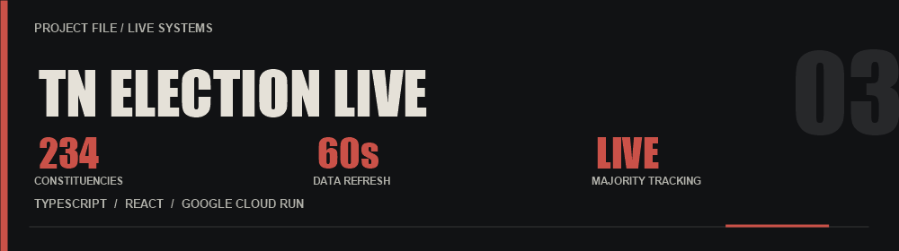</a>

[03 — TN Election Live Dashboard →](https://github.com/suren1013/TN-Election-Live-Dashboard)

Open project file — problem & implementation

**Problem** — Live election results are easier to understand when seat movement, constituency status, and the majority threshold are visible in one place.

**Built** — A deployed dashboard covering 234 constituencies with 60-second data refresh, party and alliance aggregation, search and filtering, and majority tracking.

[Live application →](https://tn-election-dashboard-2026-1096783328687.us-west1.run.app)

 

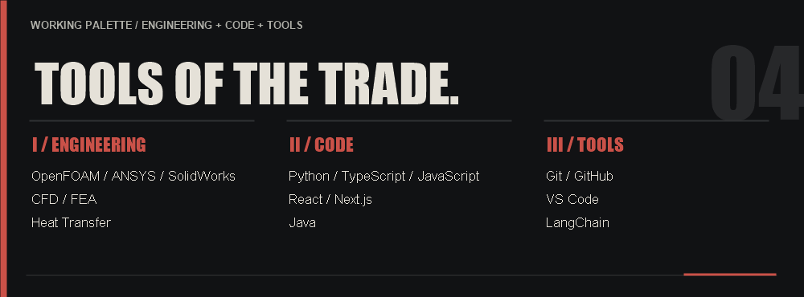

04 / Working palette — text version

| Engineering | Code | Tools |
| :--- | :--- | :--- |
| OpenFOAM · ANSYS · SolidWorks · CFD · FEA · Heat Transfer | Python · TypeScript · JavaScript · React · Next.js · Java | Git · GitHub · VS Code · LangChain |

 

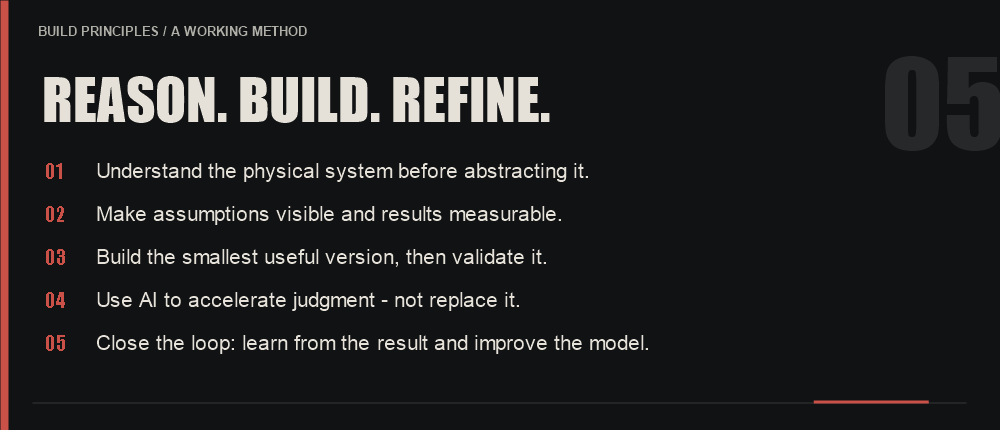

05 / Build principles — read the complete method

1. Understand the physical system before abstracting it.
2. Make assumptions visible and results measurable.
3. Build the smallest useful version, then validate it.
4. Use AI to accelerate judgment—not replace it.
5. Close the loop: learn from the result and improve the model.

> Understand the system. Build the simplest useful version. Then make it better.

 

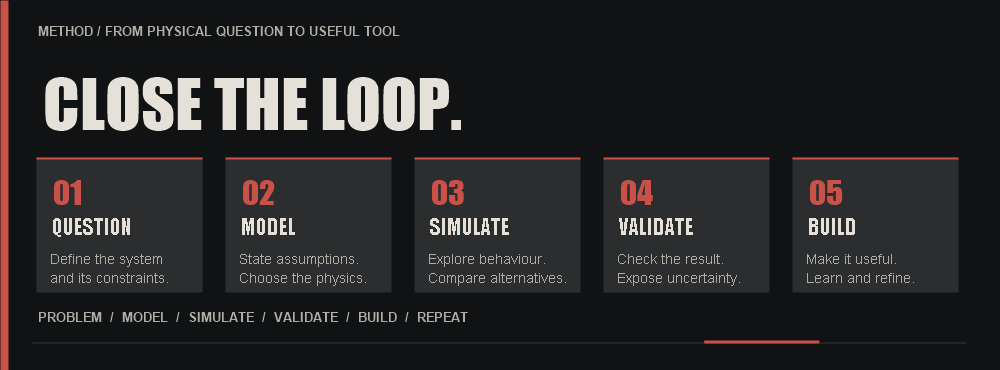

Engineering workflow — close the loop

**Question** — Define the physical system, the constraints, and the decision the work needs to support.

**Model** — Make the assumptions explicit. Choose the physics and the level of detail the problem needs.

**Simulate** — Explore behaviour and compare alternatives. Keep the inputs and outputs traceable.

**Validate** — Check whether the result makes physical sense. Make uncertainty and limitations visible.

**Build** — Turn the result into something useful: an engineering decision, an interactive tool, or a repeatable workflow. Learn from the outcome and improve the model.

Three questions guide the loop: **What are we assuming? What would change the result? What evidence would make us trust it?**

 

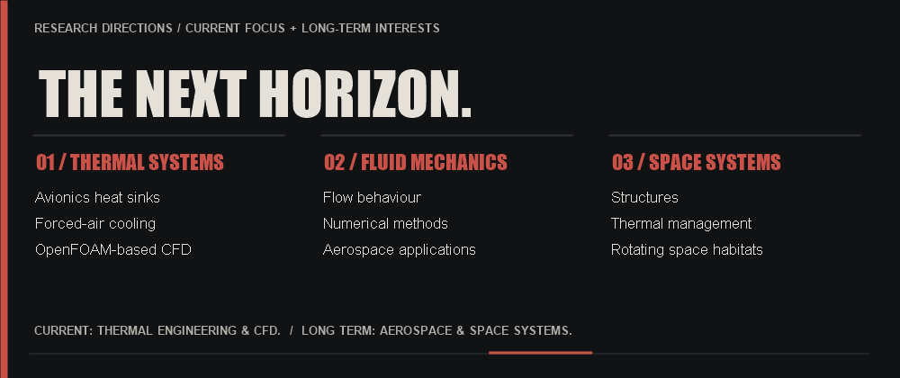

Research directions — current focus and future interests

**Current focus / Thermal systems** — Forced-air cooling for avionics heat sinks, heat transfer, and OpenFOAM-based CFD. The connection between a physical cooling problem and a computable model is at the centre of this work.

**Continuing study / Fluid mechanics and computation** — OpenFOAM, numerical methods, and better engineering code. I am interested in the point where understanding a flow becomes a useful engineering decision.

**Long-term interests / Aerospace and space systems** — Thermal management, fluid mechanics, structures, and rotating space habitats. My long-term aim is to contribute to large-scale aerospace and space systems.

 

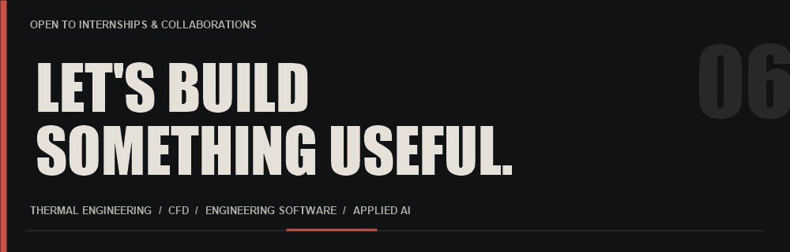

I am open to **internships and collaborations** in thermal engineering, CFD, engineering software, and applied AI.

Collaboration starting points

- **Thermal engineering & CFD** — A physical cooling problem with clear geometry, constraints, and a question to investigate.
- **Engineering software** — A calculation or workflow that could become a useful interactive tool.
- **Data & automation** — A repeated process that needs clearer validation, cleaner inputs, or a better route from analysis to export.

An initial conversation can start with the problem, the available inputs, and the outcome you want to reach.

[Connect on LinkedIn →](https://www.linkedin.com/in/surendher-r/) &nbsp; / &nbsp; [Send me an email →](mailto:rsurendher35@gmail.com)

 

[Explore the repository archive →](https://github.com/suren1013?tab=repositories)

Mechanical engineering, computation, and a lot of building.

[Return to the motion version →](./README.md)
